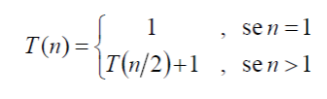
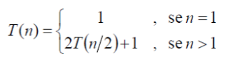

# Universidade Federal de Roraima
## Departamento de Ciência da Computação
## Análise de Algoritmos
## Atividade – Aula 03/04
## ALUNO(A):GUILHERME LUCAS PEREIRA BERNARDO 
## ATENÇÃO: Vale ressaltar que esta atividade será utilizada APENAS  para reforçar o conteúdo ministrado em sala de aula.
### [Questão – 02] Apresente a função de custo para relação de recorrência abaixo:
(A)  (B) 

### [Questão – 01]  Obtenha a função de custo e a complexidade de tempo para cada um dos trechos de código presentados abaixo:
(A) 
```
	fibonacci (int n) {
	int f, f1,f2;
	if ((n==0) | | (n==1)) return n;
	f1=0; f2=1;
	for (int i=2; i<=n, i++) {
	f= f1+f2;
	f1=f2;
	f2=f;
	}
	return f;
	}
```
(B) 
```
	Hanoi(n, Origem, Destino, Auxiliar){
	se n > 0{ 
		Hanoi(n-1,Origem,Auxiliar,Destino)
		move o disco da Origem para o Destino
		Hanoi(n-1, Auxiliar,Destino, Origem)
		}
	}
```